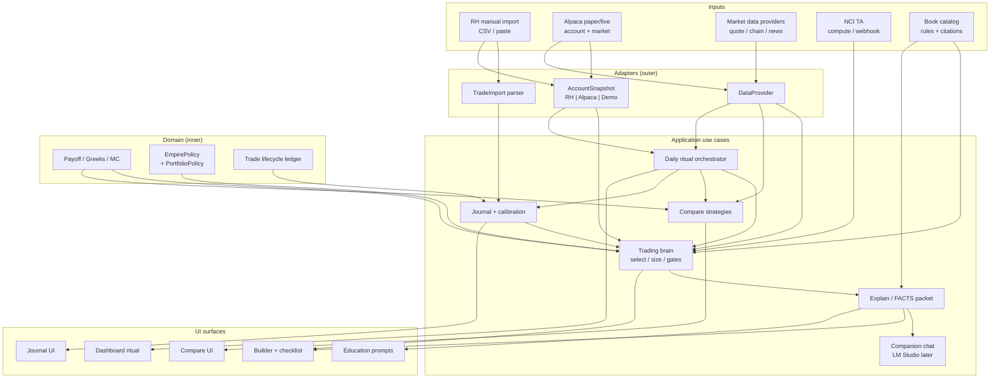

# ADR / Architecture — OptionScope → Personal Empire Companion Gaps

**Status:** Accepted (implementation backlog)  
**Date:** 2026-07-12  
**Classification:** Michael Chapman personal use until real profits proven  
**Source brief:** [`00-PERSONAL-COMPANION-BRIEF.md`](./00-PERSONAL-COMPANION-BRIEF.md)  
**Roadmap:** [`../../ROADMAP.md`](../../ROADMAP.md)

---

## Problem & constraints

OptionScope is a **strong quantitative options workbench** (live chain → market context → brain rank/size/explain → Robinhood checklist). The empire brief reframes it as Michael’s **personal capital-survival companion**: seed **$500** → **$5k** → **$25k**, with real RH history in view, honest journal calibration, and a daily ritual — **not** a public SaaS launch.

| Constraint | Implication |
|------------|-------------|
| Capital first, product second | Features that don’t protect or grow capital wait |
| No RH password / no reverse-engineered login | Import = CSV, paste, manual snapshot only |
| No auto-trade | Brain + checklist only; human executes |
| $500 options reality | Most CSP/wheel structures are **ineligible**; micro defined-risk + paper until process works |
| Educational companion | Not advice to third parties; model PoP/EV = estimates |

---

## 1. Current architecture strengths

Evidence from `src/` (Phases 0–5.0b largely locked).

### 1.1 Domain core (truth layer)

| Module | Role |
|--------|------|
| `src/domain/*` | Black-Scholes, binomial, Monte Carlo, payoff, collateral, strategy defs, trade lifecycle ledger |
| `src/lib/compare.ts` | Side-by-side PoP / EV / RoR (engine ready; UI not) |
| `src/lib/orderChecklist.ts` | Robinhood manual checklist model |
| `src/lib/marketContext.ts` | IV rank, trend, EM, liquidity, events, news → typed `MarketContext` |

**Why it matters:** Math and risk geometry are already auditable and testable. Companion chat (later) must **read** these facts, never invent them.

### 1.2 Trading brain (decision layer)

| Module | Role |
|--------|------|
| `src/brain/selector.ts` | Filter → score → size → ranked recommendations |
| `src/brain/riskGates.ts` | Daily loss halt, campaign cap, risk budget, undefined-risk block, liquidity/events |
| `src/brain/portfolio.ts` | Position size + profit split (options float vs portfolio core) |
| `src/brain/instantiate.ts` + `engineScore.ts` | Live chain legs + PoP/EV/RoR |
| `src/brain/explain.ts` | Catalog-grounded thesis / risks / citations (`POST /api/brain/explain`) |
| `src/knowledge/portfolioPolicy.ts` | Locked `NCI-OS-BRAIN-1.0.0`: RH broker, `manual_checklist_only`, `blockUndefinedRisk` |

**Why it matters:** Policy direction is correct for empire use (defined-risk bias, no auto-trade). Growth-lock tests exist under mid-size equity fixtures.

### 1.3 Data & account adapters

| Module | Role |
|--------|------|
| `src/data/providers/*` | demo / polygon / openbb / alpaca market data |
| `src/data/alpacaTrading.ts` | Paper/live **account snapshot** for sizing (never places orders) |
| `src/brain/liveAccount.ts` | Alpaca → `AccountState` |
| `src/indicators/nciTa/*` | Chart bias layer (compute API + TV webhook) |
| `src/knowledge/catalog/*` | ~2270 book entries + strategy rules / ingest seeds |

### 1.4 Journal foundation (logic without product surface)

| Module | Role |
|--------|------|
| `db/schema.sql` | trades, cash_events, forecast snapshot immutability, profiles |
| `src/db/journalRepo.ts` | CRUD + lifecycle transitions + cash events |
| `src/db/calibration.ts` | PoP bins, Wilson CI, by-strategy / by-DTE stats |
| `src/domain/tradeLifecycle.ts` | Wheel/campaign ledger math |

### 1.5 App shell

Routes exist: Dashboard, Builder (+ brain panel), Compare (stub), Journal (stub), Education (risk concepts), Settings (env table), Saved (stub messaging).

### Verdict on fitness

| Mission need | Fitness today |
|--------------|---------------|
| Always-on options obsession (chains, Greeks, structures) | **Strong** on builder + brain |
| Brain assistance (rank, size, explain, checklist) | **Strong** |
| Robinhood account data in | **Weak** — RH is copy only; live equity is Alpaca/demo |
| Small-account / $500 survival | **Weak** — demo equity **$25k**; no capital-phase policy |
| Journal calibration loop | **Logic ready, product missing** |
| Daily ritual companion | **Design mock only** |
| Public SaaS readiness | **Out of scope** until profits |

---

## 2. Gaps (mission-critical)

### 2.1 Robinhood import

**Brief:** See what was already done; flag what to fix. Manual export/CSV or paste first.

| Layer | Today | Gap |
|-------|-------|-----|
| Policy | `broker: "robinhood"`, checklist copy | No import path |
| Account | Alpaca `LiveBrokerSnapshot` **or** `DEFAULT_DEMO_ACCOUNT` ($25k) | No RH equity/cash/positions model |
| Positions | Alpaca option market-value proxy for open risk | No RH option legs, cost basis, open P/L |
| History | Journal empty until Supabase + UI | No RH fills → trade journal mapping |
| UI | Order checklist for *future* entries | No “what I already did” review surface |

**Risks if unfixed**

- Brain sizes against **wrong capital** (paper Alpaca ≠ RH seed).
- Cannot flag bad structures already open (undefined risk, oversized CSP, earnings holds).
- Calibration never starts because real history never lands.

**Safe import strategy (ordered)**

1. **Paste snapshot** — equity, cash, positions as structured JSON/YAML (fastest).
2. **CSV import** — RH activity / tax / positions export (column map + validation).
3. **Never** unofficial RH auth or credential storage.

**Target capabilities**

- Normalize RH rows → `TradeImport` → optional `TradeRow` (planned/opened).
- `AccountSnapshotRh` → `AccountState` via same `mapLiveToAccountState` shape (source: `"robinhood_manual"`).
- “Flag what to fix” rules: undefined risk, max-loss > policy, wide wings, earnings into short premium, size > absoluteMaxLossPct.

---

### 2.2 Small-account policy ($500 seed reality)

**Brief:** Many strategies need more capital than $500; design for **defined-risk micro** and **paper until process works**.

| Reality | Current code behavior |
|---------|----------------------|
| Demo account | equity **25_000**, cash 20_000, shares on AAPL/MSFT/SPY |
| Growth-lock test | starts at **10_000** |
| Policy modes | aggressive / balanced / income — all assume meaningful equity |
| CSP | full strike × 100 collateral (correct for RH) → **ineligible** on most names at $500 |
| Wheel universe | AAPL, MSFT, AMZN, NVDA, … — **not** seed-friendly |
| `sizePosition` | returns 0 contracts when 1 lot exceeds risk cap (safe but **silent** for micro) |

**Missing concepts**

| Concept | Needed behavior |
|---------|-----------------|
| Capital phase | `seed` \| `stage1` \| `stage2` from brief ladder |
| Micro strategy allowlist | Debit verticals / tight credit verticals / long options with max debit ≤ X% equity; block CSP unless collateral fits |
| Cheap-underlying bias | Prefer underlyings where 1-wide or 2.5-wide verticals cost ≤ risk budget |
| Paper-first gate | `processMode: "paper_rehearsal" \| "live_manual"` — brain still ranks; live mode requires journal checklist confirmation |
| Honest zero-size messaging | “1-lot max loss $X > $500 risk budget — use paper / widen capital / pick cheaper structure” |
| Absolute floors | e.g. never risk > $25–$50 on seed without explicit override flag |

**Trade-off:** Aggressive growth %s on $500 produce toy sizes or zero trades. Prefer **process integrity** over “always show 1 contract.”

---

### 2.3 Journal + calibration

| Piece | Status |
|-------|--------|
| Schema + RLS-oriented tables | Designed (`db/schema.sql`) |
| `journalRepo` | Implemented |
| `computeJournalStats` / calibration bins | Implemented |
| Journal page | **Stub** — “connect Supabase” only |
| API routes (`/api/journal/*`) | **Missing** |
| Builder → “Log as planned trade” | **Missing** |
| Forecast immutability UI | Logic in repo; no surface |
| Brain weight from calibration | **Missing** (Phase 7 roadmap) |
| Local-first personal mode | Supabase may be overkill for solo use — optional `localStorage` / SQLite-later adapter |

**Gap for empire:** Without a journal that captures **entry forecast + exit actual**, the companion cannot learn whether PoP/EV are honest for Michael’s process. Calibration must feed **selector priority dampening** only after N≥30 closed trades (already warned in `sampleWarning`).

---

### 2.4 Compare UI

| Piece | Status |
|-------|--------|
| `compareStrategies` / `sortCompare` | Done |
| Brain `engineScore` reuses compare | Done |
| `/compare` page | Placeholder only |

**Gap:** Mission needs fast A/B/C of micro structures under **same** spot/σ/DTE before checklist. Wire UI to builder legs or brain top-N recommendations (max 3).

---

### 2.5 Companion chat (LM Studio — later)

| Piece | Status |
|-------|--------|
| Deterministic explainer | Done (`explainStrategy`) |
| `AI_EXPLAIN_MODE=llm` hook | Roadmap optional |
| LM Studio constitution | Parked in `docs/research/LM_STUDIO_OPTIONS_BRAIN_DIRECTIVES.md` |
| Chat UI / multi-turn | **Not built** |
| Live Options Packet schema | Specified in research doc; not a first-class type in `src/` |

**Architectural law (do not violate when implementing):**

```
Domain + Brain = truth numbers + policy
LM Studio     = teaching / stress-test dialogue over FACTS packet only
Human         = execution
```

**Until profits:** ship **facts packet + deterministic explain**. Defer LM Studio to ~95% product complete (P2+).

---

### 2.6 Daily ritual

**Design signal:** `design/mocks/journal-ritual.html` exists; production app has no ritual flow.

**Missing end-to-end loop**

```text
Open day → Account snapshot (RH paste / Alpaca) → Watchlist scan
  → MarketContext + NCI TA → Brain top picks (phase-aware)
  → Compare micro structures → Checklist → Journal "opened"
  → EOD: mark open risk, log closes, calibration strip → Halt if daily loss gate
```

Dashboard today is chart + context + quick links — not a **capital-first command ritual**.

---

## 3. Target architecture (mermaid)



### Dependency rules (enforce)

1. **Domain** never imports Next.js, Supabase, Alpaca, or LM Studio.
2. **Brain** depends on domain + knowledge + market context types only.
3. **Adapters** implement ports: `AccountPort`, `TradeImportPort`, `MarketDataPort`, `JournalPort`.
4. Controllers/pages call use cases — not repositories directly (except documented personal shortcuts).
5. Chat may only receive a **signed FACTS packet** produced by brain/domain; model cannot set size or bypass gates.

---

## 4. Phased build

### P0 — Survival (2 weeks)

**Goal:** Michael can run a **safe daily loop** on true small capital (or honest paper) without wrong-size recommendations.

| # | Work item | Owner lane | Acceptance |
|---|-----------|------------|------------|
| P0.1 | `EmpirePolicy` + capital phases (`seed` / `stage1` / `stage2`) + micro allowlist | Backend | Seed equity $500 → CSP on $200 stock rejected; tight vertical / long option allowed only if 1-lot fits risk |
| P0.2 | Seed demo account preset + Settings equity override (local) | Backend + Frontend | Default demo no longer pretends $25k when phase=seed |
| P0.3 | RH **paste** account snapshot → `AccountSnapshotRh` → `AccountState` | Backend | Source badge: `robinhood_manual`; brain sizes from pasted equity |
| P0.4 | Zero-size / blocked reasons surfaced on brain cards | Frontend | User sees *why* contracts=0 (cash, phase, max loss) |
| P0.5 | Journal MVP without multi-tenant SaaS pressure | Backend + Frontend | Local or Supabase: create planned trade from builder with **immutable forecast** |
| P0.6 | Open → close transition + realized P/L | Backend + Frontend | One full lifecycle in UI |
| P0.7 | Dashboard “Today” ritual strip | Frontend | Equity phase, open risk, daily P/L gate, link to top brain pick |
| P0.8 | Education: $500 reality + micro structures page section | Frontend | Hard-law copy from brief |

**Explicit P0 non-features:** LM Studio chat, multi-user auth polish, marketing site, backtest v1.

### P1 — Ladder ($500 → $5k process)

**Goal:** Import real history, calibrate honesty, compare structures, scale policy when equity crosses stage gates.

| # | Work item | Owner lane | Acceptance |
|---|-----------|------------|------------|
| P1.1 | RH **CSV** activity/positions import → `TradeImport[]` | Backend | Dry-run preview + commit; reject garbage rows with row errors |
| P1.2 | “Flag what to fix” on imported opens | Backend + Frontend | List of policy violations per position |
| P1.3 | Calibration dashboard (bins + Wilson + sample warning) | Frontend | Uses `computeJournalStats` |
| P1.4 | Soft re-weight: downrank strategies with poor realized vs forecast (N≥30) | Backend | Feature-flagged; never invent edge |
| P1.5 | Compare UI wired to `compareStrategies` (≤3) + “from brain top-N” | Frontend | Shared spot/σ/DTE controls |
| P1.6 | Stage auto-detect from equity + manual override | Backend | Crossing $5k unlocks more income structures under policy |
| P1.7 | Ritual: morning scan list + EOD close prompts | Frontend | Checklist complete before journal open |
| P1.8 | FACTS packet type export for future chat | Backend | Stable JSON schema versioned |

### P2 — Polish (after process works)

| # | Work item | Notes |
|---|-----------|-------|
| P2.1 | LM Studio companion chat over FACTS only | Follow research constitution |
| P2.2 | Chart payoff overlay + selector backtest (Roadmap Phase 6) | Edge measurement |
| P2.3 | Multi-TF NCI bars from provider | Optional deepen |
| P2.4 | Catalog citations on all cards | UX polish |
| P2.5 | Graphic prompts per screen (education book) | Personal guide assets |
| P2.6 | Public SaaS packaging | **Only after real profits validate path** |

---

## 5. Interfaces / schemas to add

Place new types under `src/domain/` or `src/brain/` for pure models; parsers under `src/data/import/` or `src/adapters/`.

### 5.1 `TradeImport`

```ts
/** Normalized row before journal persistence. Source-agnostic. */
export type TradeImportSource = "robinhood_csv" | "robinhood_paste" | "manual" | "alpaca_export";

export type TradeImportSide = "buy_to_open" | "sell_to_open" | "buy_to_close" | "sell_to_close"
  | "buy" | "sell" | "assignment" | "exercise" | "expiration";

export interface TradeImportLeg {
  symbol: string;                 // OCC or underlying
  assetClass: "equity" | "option";
  side: TradeImportSide;
  qty: number;                    // shares or contracts
  price: number | null;           // fill price if known
  strike?: number;
  optionType?: "call" | "put";
  expiration?: string;            // YYYY-MM-DD
  fees?: number;
}

export interface TradeImport {
  id: string;                     // stable hash of source row(s)
  source: TradeImportSource;
  sourceRef?: string;             // CSV row id / paste block id
  underlying: string;
  strategyHint: string | null;    // optional parser guess
  legs: TradeImportLeg[];
  filledAt: string | null;        // ISO
  realizedPl: number | null;
  notes?: string;
  raw?: Record<string, unknown>;  // original columns for audit
  parseWarnings: string[];
}
```

**Journal bridge:** `TradeImport` → `NewTradeInput` when user confirms strategy + optional forecast attach (imports often lack model forecast → mark `forecast` as `import_unknown` variant or require post-hoc engine re-score as *estimate only*).

### 5.2 `AccountSnapshotRh` (manual RH)

```ts
export interface AccountSnapshotRh {
  source: "robinhood_manual";
  asOf: string;                   // ISO — when Michael captured it
  equity: number;
  cash: number;
  buyingPower?: number;
  /** Long shares for covered-call gates */
  sharesHeld: Record<string, number>;
  /** Open option positions (best-effort from paste/CSV) */
  optionPositions: Array<{
    symbol: string;               // OCC
    underlying: string;
    qty: number;                  // + long / − short contracts
    avgCost: number | null;
    mark: number | null;
    strike: number;
    optionType: "call" | "put";
    expiration: string;
    marketValue: number | null;
  }>;
  openRiskDollars: number;        // user or engine estimate
  openCampaigns: number;
  dailyRealizedPL: number;
  parseWarnings: string[];
}
```

**Map:** `AccountSnapshotRh` → `LiveAccountClient`-compatible → existing `mapLiveToAccountState`. Prefer extending `LiveAccountClient.source` to `"alpaca" | "demo" | "robinhood_manual"`.

### 5.3 `EmpirePolicy` (extends / wraps portfolio policy)

```ts
export type CapitalPhase = "seed" | "stage1" | "stage2";

export interface EmpirePolicy {
  version: string;                // e.g. "EMPIRE-1.0.0"
  /** Ladder from companion brief */
  ladder: {
    seed: { minEquity: 0; maxEquity: 500; label: "$500 seed" };
    stage1: { minEquity: 500; maxEquity: 5000; label: "$500→$5k" };
    stage2: { minEquity: 5000; maxEquity: 25000; label: "$5k→$25k" };
  };
  /** Active phase: auto-from equity or manual lock */
  phaseMode: "auto" | "manual";
  phaseOverride?: CapitalPhase;
  processMode: "paper_rehearsal" | "live_manual";
  /** Per-phase risk overrides (tighten seed) */
  phaseRisk: Record<
    CapitalPhase,
    {
      perTradeRiskPct: number;
      perTradeRiskCapPct: number;
      openRiskBudgetPct: number;
      absoluteMaxLossPct: number;
      maxOpenCampaigns: number;
      /** Max debit or max loss dollars for any single new trade (hard floor) */
      maxRiskDollars: number;
      allowCsp: boolean;
      allowUndefined: false;       // always false in companion
      strategyAllowlist: string[]; // strategyId list
      preferredUnderlyings: string[];
    }
  >;
  /** PortfolioPolicy pin */
  brainPolicyVersion: "NCI-OS-BRAIN-1.0.0";
  import: {
    allowCsv: boolean;
    allowPaste: boolean;
    neverStoreRhPassword: true;
  };
}
```

**Suggested seed defaults (starting point — tune in tests):**

| Knob | Seed | Stage 1 | Stage 2 |
|------|------|---------|---------|
| maxRiskDollars | 25–50 | 100–150 | policy % |
| allowCsp | false unless collateral fits | selective | true in universe |
| strategyAllowlist | long call/put, debit verticals, tight credit verticals | + IC / butterflies when size fits | full defined-risk income set |
| processMode default | paper_rehearsal | live_manual optional | live_manual |

**Integration point:** `evaluateRuleGates` + `sizePosition` read `EmpirePolicy.phaseRisk[phase]` *before* or *instead of* flat `growthModes` percentages when phase is seed.

### 5.4 Supporting ports (thin)

```ts
export interface AccountPort {
  getSnapshot(): Promise<
    | { ok: true; snapshot: AccountSnapshotRh | /* Alpaca mapped */ LiveAccountClient }
    | { ok: false; error: string }
  >;
}

export interface TradeImportPort {
  parse(input: { kind: "csv" | "paste"; body: string }): Promise<TradeImport[]>;
}

export interface JournalPort {
  createPlanned(input: NewTradeInput): Promise<TradeRow>;
  transition(...): Promise<TradeRow>;
  list(...): Promise<TradeRow[]>;
  stats(trades: TradeRow[]): JournalStats; // pure: wrap computeJournalStats
}
```

### 5.5 FACTS packet (P1 schema freeze)

Versioned envelope for explain + future LM Studio:

```ts
export interface LiveOptionsFactsPacket {
  version: "facts-1.0.0";
  asOf: string;
  symbol: string;
  account: { source: string; equity: number; cash: number; phase: CapitalPhase; processMode: string };
  context: MarketContext;
  nciTa: BrainDecision["nciTa"];
  recommendations: Array<{ /* legs, engine metrics, size, gates */ }>;
  disclaimer: string;
}
```

---

## 6. Non-goals until profits

Do **not** spend empire capital-time on:

1. Public multi-tenant SaaS, billing, team roles, marketing site  
2. Unofficial Robinhood login / scraping / password vault  
3. Auto-trading, broker order placement APIs for RH, “set and forget” bots  
4. LM Studio / local LLM chat as a **blocker** for P0–P1 (backburner until facts ritual works)  
5. Undefined-risk sandbox as a growth path (education only, labeled)  
6. Broad underlyings / meme lottery structures as seed “strategy”  
7. Perfect IV surface / exotic vol models before process + journal honesty  
8. Mobile app store release  
9. Social features, leaderboards, copy-trading  
10. Replacing domain math with model-generated strikes or sizes  

**Doctrine restated:** capital survival and process proof **before** productization.

---

## 7. Risk register (architecture)

| Risk | Severity | Mitigation |
|------|----------|------------|
| Brain sizes off Alpaca/demo while RH is $500 | **Critical** | RH paste + phase policy P0 |
| User force-trades 1 CSP that needs $20k | **Critical** | allowCsp=false + collateral gate + UI block reasons |
| Journal never used → no calibration | High | One-click “log from builder” in P0 |
| Supabase friction for solo use | Medium | Local journal adapter option |
| LLM freelances trades later | High | FACTS-only constitution; engine owns numbers |
| Compare/journal stubs erode trust | Medium | P0 journal + P1 compare |

---

## 8. Handoff

### Backend agent (next)

1. Add `EmpirePolicy` module + unit tests at **$500 / $5k / $25k** equity fixtures (extend `tests/brain/*`).  
2. Implement `AccountSnapshotRh` + paste parser + map into `mapLiveToAccountState`.  
3. Implement `TradeImport` types + CSV column map (RH activity export sample-driven).  
4. Journal API routes (or local file/JSON repo) wrapping `journalRepo` / pure stats.  
5. Gate integration: phase risk overrides in `riskGates` + `sizePosition`.  
6. Export `LiveOptionsFactsPacket` builder from brain decision + scored recs.  

**Do not:** place orders, store RH passwords, call unofficial RH APIs.

### Frontend agent (next)

1. Settings: capital phase, process mode, paste RH snapshot form, equity override.  
2. Brain cards: blocked/zero-size reasons; phase badge.  
3. Journal UI: list, open/close, forecast frozen panel, calibration strip (consume stats).  
4. Compare page: wire `compareStrategies` (≤3), import from builder/brain.  
5. Dashboard ritual strip: equity, open risk, daily halt, next action CTA.  
6. Education: small-account / micro defined-risk section.  

**Do not:** build LM Studio chat UI in P0; keep checklist manual-only.

### Design / education (parallel, non-blocking)

- Promote `design/mocks/journal-ritual.html` → production ritual layout tokens already in app.  
- Graphic prompts per dashboard feature (brief requirement #4) after P0 surfaces stabilize.

---

## 9. Summary

| Dimension | Assessment |
|-----------|------------|
| Quantitative engine + brain | **Ready** for companion core |
| Broker doctrine (manual RH) | **Correct policy**, incomplete **data** path |
| Capital ladder fitness | **Not ready** — demo/$10k fixtures lie about seed life |
| Journal calibration | **Backend math ready**, product + feedback loop missing |
| Compare / ritual / chat | Engine/mock/research ahead of UI |
| Empire path | **P0 survival in 2 weeks** is feasible if scope stays ruthless |

**Next recommendation:** Backend implements `EmpirePolicy` + RH paste snapshot + phase-aware gates first; Frontend parallelizes journal MVP + brain zero-size UX. Reassess LM Studio only after daily ritual + N real journaled trades.

---

_Educational decision support only. Not investment advice. Not affiliated with Robinhood._
